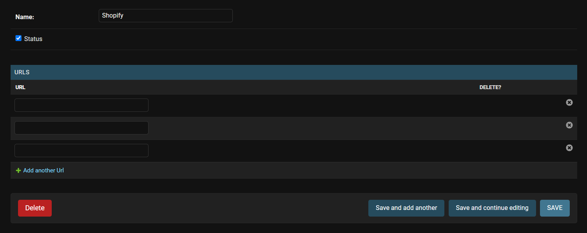

# Shopify-Scraper

A Shopify Scraper which allowss you to add multiple stores and fetch data into database

## Multiple Endpoints
You can add mutiple URLS for single Shopify Stores, and fetch data from all of them.

