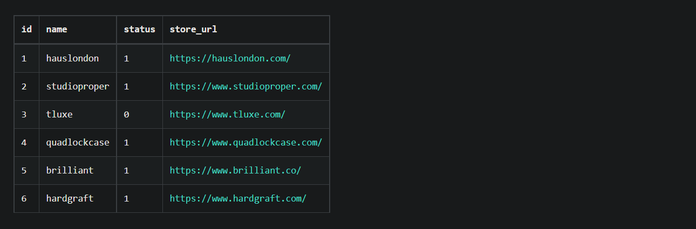

# Shopify Scrapper

The Goal is to scrape any Shopify Store. This Scrapper allows you to add multiple stores and fetch data into database.

The web scraper will save the results in a database, and the subsequent scrape will only include the freshest results that have been updated to website since the previous scrape. For instance, the web scraper will disregard items and variants that were already discovered in the earlier scrape. We don't want it to repeatedly add the same versions. If it wasn't discovered during the most recent scrape, it must only contribute to the database. The web scraper have a 5 minute delay before restarting the script.

## Features
- Add Multiple Website to scrape.
- Control which website to scrape.

## Future Scope
- Scheduling scrapping task.
- Method for emailing users when webpage scraping is complete.

## DATABASE

### WEBSITES
This table stores the data about the website that needs to be scrapped, In consist of name of website, status wether to scrape or not, and the store url and other endpoints.

### DATA TABLE
All the Products are stored in the **Data** table with the attributes shown in the below pictre

### VARIANTS TABLE
This Table is used to store the multiple **Variants** of the a products. 

### IMAGE TABLE
This Table stores the Images of the products

